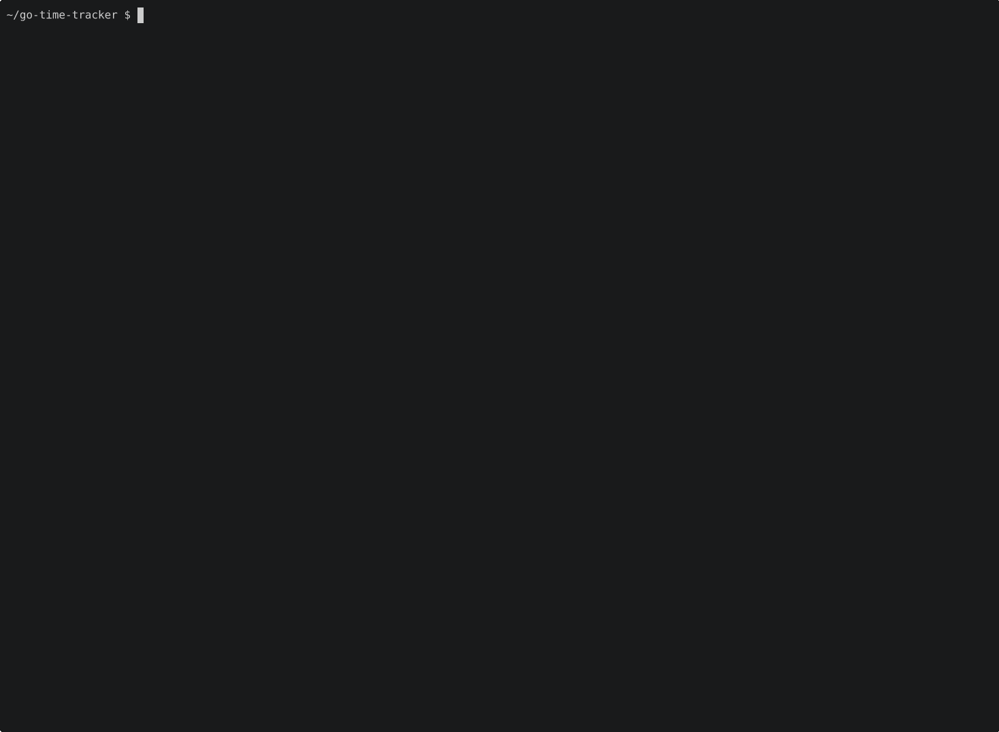

# go-time-tracker

A terminal-based time tracker that stores your time entries as plain Markdown files.



## Features

- **TUI** — keyboard-driven interface built with [Bubble Tea](https://github.com/charmbracelet/bubbletea)
- **Markdown storage** — one readable file per day in `~/.time-tracker/days/`, easy to edit or version-control
- **Notes** — attach freeform notes to any profile
- **Entry editing** — correct start/end times without leaving the TUI
- **Reports** — `gtt report week` shows a summary for any date or range
- **Live reload** — edits to the Markdown files are reflected immediately while `gtt` is running

## Installation

### Pre-built binaries

Download the latest release from the [releases page](https://github.com/kubeone/go-time-tracker/releases).

### Install with Go

```bash
go install github.com/kubeone/go-time-tracker@latest
```

### Build from source

```bash
git clone https://github.com/kubeone/go-time-tracker.git
cd go-time-tracker
go build -o gtt .
```

## Quick start

```bash
gtt          # open the TUI
gtt report   # show today's report
```

See [docs/getting-started.md](docs/getting-started.md) for full setup and usage instructions.

## Keyboard shortcuts

| Key | Action |
|-----|--------|
| `↑` / `k` | Select previous profile |
| `↓` / `j` | Select next profile |
| `s` | Start timer |
| `x` | Stop timer |
| `r` | Resume last timer |
| `n` | Edit notes |
| `e` | Edit time entries |
| `←` / `→` | Switch day |
| `q` | Quit |

## Storage format

```
~/.time-tracker/       # Linux / macOS
%APPDATA%\gtt\         # Windows
├── config.yaml          # profile definitions
└── days/
    ├── 2026-06-25.md
    └── 2026-06-26.md
```

Each day file is valid Markdown — you can read, edit, or commit it to git directly.

## Windows

`gtt` runs on Windows but requires [Windows Terminal](https://aka.ms/terminal) for correct rendering of the TUI. The legacy `cmd.exe` console and old PowerShell window do not support the ANSI escape codes used for colours and layout.

## Contributing

Contributions are welcome. Please read [CONTRIBUTING.md](CONTRIBUTING.md) before opening a pull request.

## License

[MIT](LICENSE) © Soeren Henning
